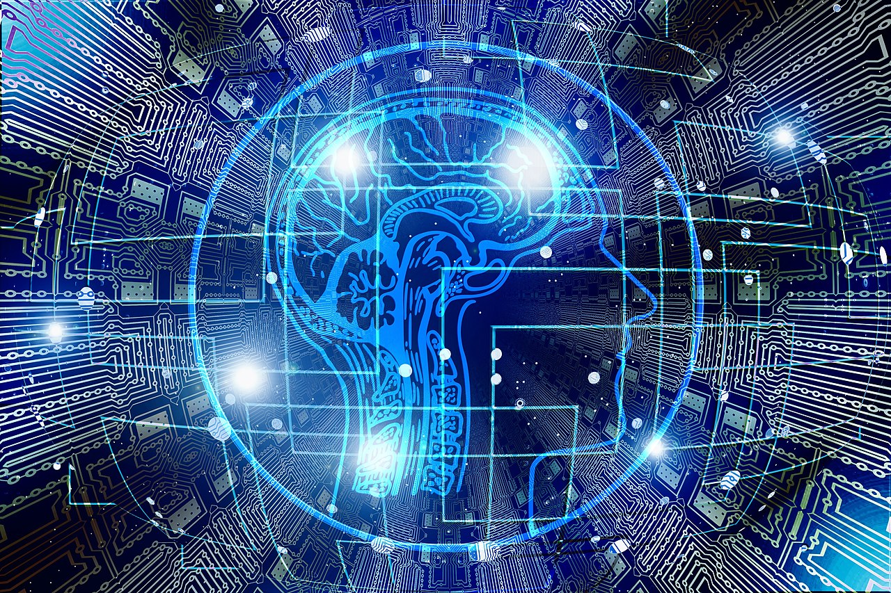
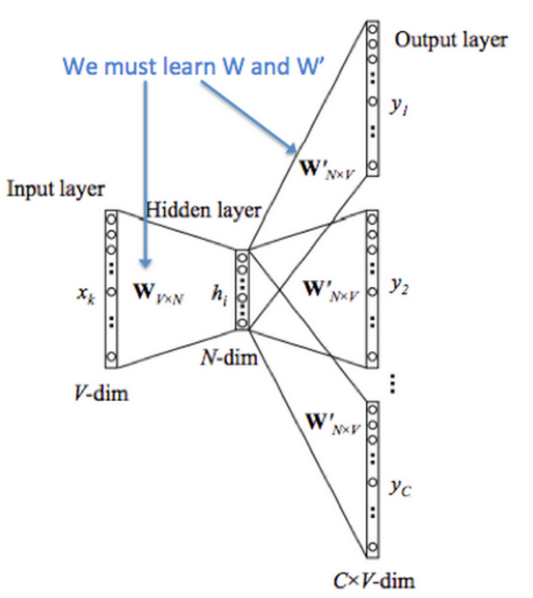
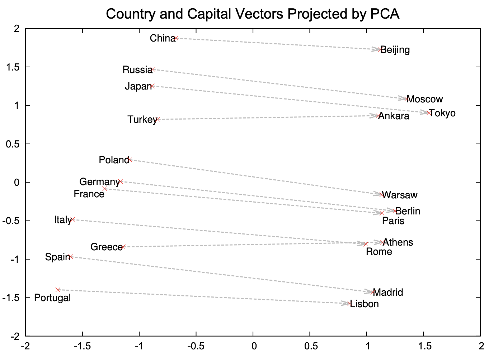
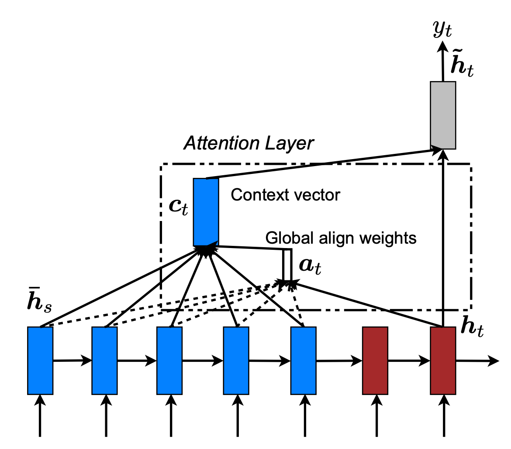
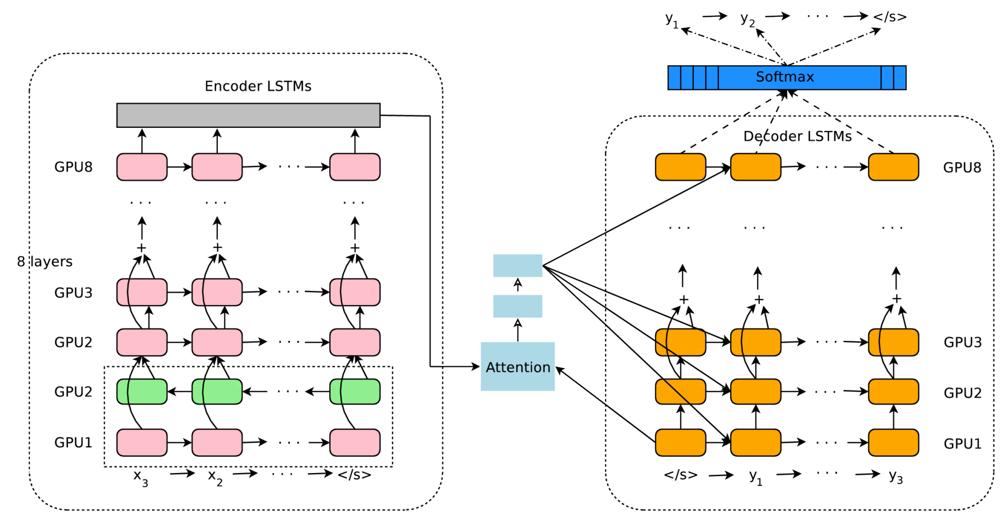
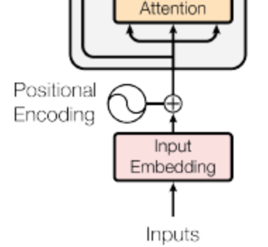
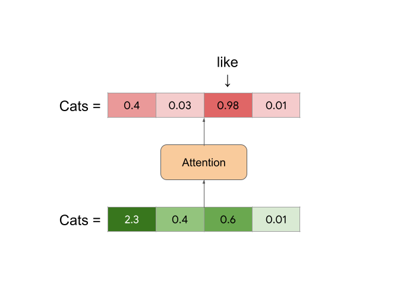
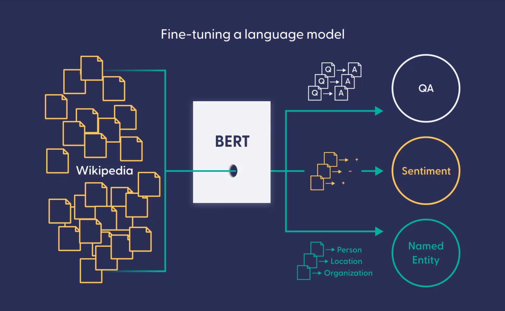
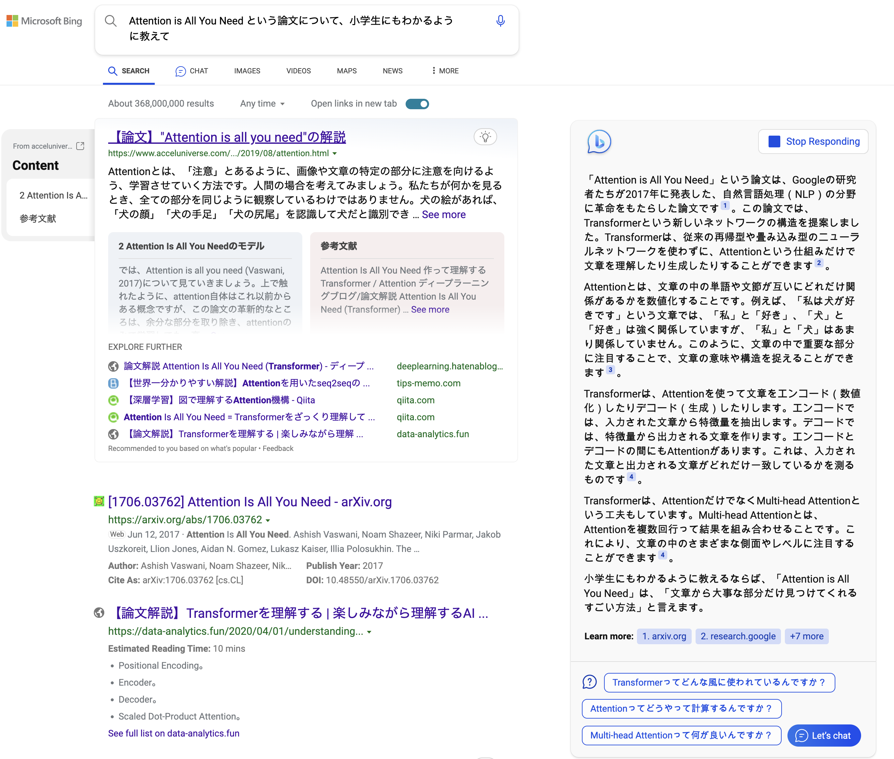

<!-- 
_class: title 
_paginate: false
-->
# Large language models easily explained
&nbsp; &nbsp; yukoga@

<!--
_color: white
_footer: 'Licensed by [Pixabay](https://pixabay.com/es/illustrations/inteligencia-artificial-cerebro-3382507/)'
-->

---
## Contents 

- ### GPT-3 playground
- ### What are language models?
- ### How GPT-3 works
- ### LLM for businesses

---
<!--
style: |
    table {
        font-size: 18pt;
        margin: auto;
    }
    thead th {
        background-color: #DDDDDD;
        border-color: #CCCCCC;
    }
    tbody tr td:first-child {
        background-color: #EEEEEE;
        border-color: #CCCCCC;
    }
    tbody tr td:nth-child(n+2) {
        background-color: #FFFFFF;
        border-color: #CCCCCC;
    }
    tbody tr:last-child {
        background-color: rgba(0, 0, 0, 0.0);
        border-style: solid;
        border-width: 0;
    }
-->
## GPT3 playground 

[GPT3 playground in spreadsheet - https://tinyurl.com/llmeasy](https://tinyurl.com/llmeasy)

---
## What are language models?

### Machine Learning tasks related to language (a.k.a. Natural Language Processing)  
- Classification / Sentiment analysis  
- Extraction / OCR    
- Similarity matching  
- Machine translation  
- Generate text - Summarization, Question answering ... etc.   

---
## What are language models?
Language model = Machine Learning model for NLP  
- ### Machine Translation 
  - RMT (Rule based MT) --> SMT (Statistical MT) --> NMT (Neural MT) --> Deep NMT  
- ### Sentiment Analysis  
  - Rule based --> Logistic regression / Naive Bayes --> SVM --> RNN / LSTM (Deep N)

... etc.  

- For those NLP tasks, we need to transform natural language to collection of numeric values --> vector representation / language vector --> **Language models**.  

---
<!--
_footer: 'Source: [Bag-of-words model - Wikipedia](https://en.wikipedia.org/wiki/Bag-of-words_model)'
-->
## What are language models?
Language representation before Language model  
- ### One-hot encoding 
    - I like cats. --> Define words as a vector with elements:  
    - I = [0, 1, 0, 0] / like = [0, 0, 1, 0] / cats = [1, 0, 0, 0] / . = [0, 0, 0, 1]  

- ### Bag of Words (BoW)  
  - BoW = {"word1": freq. of word1, "word2": freq. of word2, ...}  
  - Sentence 1: John likes to watch movies. Mary likes movies too.
    Sentence 2: Mary also likes to watch football games.  
    BoW1 = {"John":1,"likes":2,"to":1,"watch":1,"movies":2,"Mary":1,"too":1};  
    BoW2 = {"Mary":1,"also":1,"likes":1,"to":1,"watch":1,"football":1,"games":1};    

---
<!--
style: |
    img[alt~="center"] {
        margin: 0 auto;
    }
-->
## What are language models?
- ### Sentiment Analysis with BoW 
  

---
<!--
-->
## What are language models?
Language representation before Language model  
- ### Word2Vec (Skip-Gram) (2013) 
  Train neural network to predict context words from a target word.  
  Distributional Hypothesis: *"Words that occur in the same contexts tend to have similar meanings."*  
    - Sentence: I like cats.  
    - Skip-Gram window=1  
    (target: I, context: like)  
    (target: like, context: I) and (target: like, context: cats)   

---
<!--
style: |
    img[alt~="center"] {
        margin: 0 auto;
    }
_footer: 'Source: [CS224n: Natural Language Processing with Deep Learning (Stanford 2019)](https://web.stanford.edu/class/archive/cs/cs224n/cs224n.1194/)'
-->
## What are language models?
Neural network to train Word2Vec (Skip-Gram model).  

---
<!--

_footer: 'Source: [Distributed Representations of Words and Phrases and their Compositionality](https://proceedings.neurips.cc/paper/2013/hash/9aa42b31882ec039965f3c4923ce901b-Abstract.html)  
[Exploiting Similarities among Languages for Machine Translation](https://arxiv.org/abs/1309.4168)'  

-->
## What are language models?
Vector representation of Word2Vec. / [demo](http://projector.tensorflow.org/)  
  

|   
---|---

---
<!--
-->
## What are language models?
### How word2vec understands word?  
$$
Berlin \hspace{2pt} - Germany  \hspace{2pt} + \hspace{2pt} Japan = \hspace{2pt} Tokyo
$$
The capital of Germany is Belrin.  
The capital of Japan is Tokyo.  
I enjoyed New York in USA.  

--> The capital of USA is _______.
### Next challenge for language models  
Language model need to keep long-term memory.  
"The song were composed by Beatles." vs "This language is composed by commands."

---
<!--
style: |
    img[alt~="center"] {
        margin: 0 auto;
    }
_footer: 'Source: [Visualizing A Neural Machine Translation Model (Mechanics of Seq2seq Models With Attention)](https://jalammar.github.io/visualizing-neural-machine-translation-mechanics-of-seq2seq-models-with-attention/)'
-->
## What are language models?
### Sequence to Sequence Learning with Neural Networks (2014)
Language model which keeps long-term memory.  
"I am a student.<s>Je suis étudiant.</s>"  

---
<!--
_footer: 'Source: [Visualizing A Neural Machine Translation Model (Mechanics of Seq2seq Models With Attention)](https://jalammar.github.io/visualizing-neural-machine-translation-mechanics-of-seq2seq-models-with-attention/)  [Investigation of back-off based interpolation between recurrent neural network and n-gram language models, IEEE](https://ieeexplore.ieee.org/document/7404792)'
-->
## What are language models?
### Sequence to Sequence Learning with Neural Networks (2014)  
Under the hood of Encoder-Decoder model.  

|  
---|---  

---
<!--
style: |
    img[alt~="center"] {
        margin: 0 auto;
    }
_footer: 'Source: [Effective Approaches to Attention-based Neural Machine Translation](https://arxiv.org/abs/1508.04025)'
-->
## What are language models?
### How attention works  

---
<!--
_footer: "Source: [Google's Neural Machine Translation System: Bridging the Gap between Human and Machine Translation](https://arxiv.org/abs/1508.04025)  [Zero-Shot Translation with Google’s Multilingual Neural Machine Translation System](https://ai.googleblog.com/2016/11/zero-shot-translation-with-googles.html)"
-->
## What are language models?
### GNMT (Google Neural Machine Translation, 2016)
Zero-Shot machine translation with multilingual NMT.  

|  
---|---

---
<!--
_footer: "Source: [Attention is All you Need](https://papers.nips.cc/paper/2017/hash/3f5ee243547dee91fbd053c1c4a845aa-Abstract.html) / [The Illustrated Transformer](https://jalammar.github.io/illustrated-transformer/)"
-->
## What are language models?
### Transfomer (2017)
Attention Is All You Need.  

|  
---|---

---
<!--
_footer: "Source: [Attention is All you Need](https://papers.nips.cc/paper/2017/hash/3f5ee243547dee91fbd053c1c4a845aa-Abstract.html)  [Attention and Self-Attention for NLP
 - Modern Approaches in Natural Language Processing](https://slds-lmu.github.io/seminar_nlp_ss20/attention-and-self-attention-for-nlp.html)"

-->
## What are language models?
### Transfomer (2017)
Attention Is All You Need.  

||  
---|---|---

---
<!--
_footer: "Source: [Attention is All you Need](https://papers.nips.cc/paper/2017/hash/3f5ee243547dee91fbd053c1c4a845aa-Abstract.html)  [Attention and Self-Attention for NLP
 - Modern Approaches in Natural Language Processing](https://slds-lmu.github.io/seminar_nlp_ss20/attention-and-self-attention-for-nlp.html)"

-->
## What are language models?
### Transfomer (2017)
Attention Is All You Need.  

$$
\begin{align}

Attention(Q, K, V) &= softmax(QK^T / \sqrt d_k) * V \\
Q_i &= (W_q * x_i) + PE(i) \\
K_i &= (W_k * [x_{i-k}, \cdots x_{i+k}] ) + PE(i) \\
V_i &= W_v x_i \\
PE_{(pos,2i)} &= \sin(pos/10000^{2i/d_{model}}) \\
PE_{(pos,2i+1)} &= \cos(pos/10000^{2i/d_{model}})

\end{align}
$$

---
<!--
_footer: "Source: [Attention is All you Need](https://papers.nips.cc/paper/2017/hash/3f5ee243547dee91fbd053c1c4a845aa-Abstract.html)  [Attention and Self-Attention for NLP
 - Modern Approaches in Natural Language Processing](https://slds-lmu.github.io/seminar_nlp_ss20/attention-and-self-attention-for-nlp.html)"

-->
## What are language models?
### Transfomer (2017)
Attention Is All You Need.  

||$Q_i = (W_q * x_i) + PE(i)$   $K_i = (W_k * [x_{i-k}, \cdots x_{i+k}] ) + PE(i)$  $V_i = W_v x_i$
---|---|---

---
<!--
_footer: "Source: [Attention is All you Need](https://papers.nips.cc/paper/2017/hash/3f5ee243547dee91fbd053c1c4a845aa-Abstract.html)  [Attention and Self-Attention for NLP
 - Modern Approaches in Natural Language Processing](https://slds-lmu.github.io/seminar_nlp_ss20/attention-and-self-attention-for-nlp.html)"

-->
## What are language models?
### Transfomer (2017)
Attention Is All You Need.  

|$\text{Attention}(Q,K,V) = \text{softmax}(\frac{QK^\top}{\sqrt{d_k}})V$
---|---

---
<!--
style: |
    img[alt~="center"] {
        margin: 0 auto;
    }
_footer: "Source: [Attention is All you Need](https://papers.nips.cc/paper/2017/hash/3f5ee243547dee91fbd053c1c4a845aa-Abstract.html)  [Attention and Self-Attention for NLP
 - Modern Approaches in Natural Language Processing](https://slds-lmu.github.io/seminar_nlp_ss20/attention-and-self-attention-for-nlp.html)"

-->
## What are language models?
### Transfomer (2017)
Attention Is All You Need.  

---

<!--
style: |
    img[alt~="center"] {
        display: block;
        margin: 0 auto;
    }

_footer: 'Source: [What Is a Language Model? - deepset.ai](https://www.deepset.ai/blog/what-is-a-language-model)'
-->
## What are language models?

Language model + Fine-tuning  

<!--
---
## What are language models?

What is the mechanism of language model after all?  
$$
P_{LM}(w_1, w_2, w_3, w_4, \cdots) 
$$
- For given $P_{LM}$, text generation task would be:  
$$
\begin{aligned}
& P(cats|I, like) \propto P_{LM}(I, like, cats) \\
& P(and|I, like, cats) \propto P_{LM}(I, like, cats, and, dogs) \\
& P(dogs|I, like, cats, and) \propto P_{LM}(I, like, cats, and, dogs) \\
& P(dogs|I, like, cats, and) > P(cats|I, like, cats, and) 
\end{aligned}
$$
- For given $P_{LM}$, MT task would be:  

$$

\begin{aligned}

& P(犬|I, like, cats, and, dogs, 私, 好き, 猫, と) \\
& \propto P_{LM}(I, like, cats, and, dogs, 私, 好き, 猫, と, 犬)

\end{aligned}

$$
-->

---
<!--
style: |
    img[alt~="center"] {
        display: block;
        margin: 0 auto;
    }

_footer: 'Source: [Deciphering the Neural Language Model](https://burakhimmetoglu.com/2016/12/16/deciphering-the-neural-language-model/)'
-->
## What are language models?

What the neural language model looks like?    

---

<!--
_footer: "Source: [Large Language Models: A New Moore's Law? - Hugging Face blog](https://huggingface.co/blog/large-language-models)"
-->
## What are language models?
LLM size and history  

---
<!--
style: |
    img[alt~="center"] {
        display: block;
        margin: 0 auto;
    }

_footer: 'Source: [How GPT3 Works - Visualizations and Animations - Jay Alammar](https://jalammar.github.io/how-gpt3-works-visualizations-animations/)'
-->
## How GTP-3 works?
GTP-3 (= Generative Pre-trained Transfomer 3)

---
<!--
style: |
    img[alt~="center"] {
        display: block;
        margin: 0 auto;
    }

_footer: 'Source: [How GPT3 Works - Visualizations and Animations - Jay Alammar](https://jalammar.github.io/how-gpt3-works-visualizations-animations/)'
-->
## How GTP-3 works?
GTP-3 (= Generative Pre-trained Transfomer 3)

---
<!--
style: |
    img[alt~="center"] {
        display: block;
        margin: 0 auto;
    }

_footer: 'Source: [How GPT3 Works - Visualizations and Animations - Jay Alammar](https://jalammar.github.io/how-gpt3-works-visualizations-animations/)'
-->
## How GTP-3 works?
GTP-3 (= Generative Pre-trained Transfomer 3)

---
<!--
style: |
    img[alt~="center"] {
        display: block;
        margin: 0 auto;
    }

-->
## LLM for businesses
### What Google failed?
- Had LLM at least in 2020.
- Too aspirational to make the LLM perfect, Too conservative to early launch.
    [AI Test Kitchen](https://aitestkitchen.withgoogle.com/)  
### What OpenAI and Microsoft are doing well?
- Tried and error. 
    [Twitter taught Microsoft’s AI chatbot to be a racist asshole in less than a day](https://www.theverge.com/2016/3/24/11297050/tay-microsoft-chatbot-racist)
- Succeeded in UI/UX.
- UI/UX v.s. Revenue opportunity  
    --> Vertical specific LLM service and Cloud
<!--

-->

---
<!--
style: |
    img[alt~="center"] {
        display: block;
        margin: 0 auto;
    }

-->
## LLM for businesses
### LLM application other than NLP

Highly accurate protein structure prediction with AlphaFold (Deepmind, 2021) |GATO, A Generalist Agent (Deepmind, 2022) 
---|---

---
<!--
_paginate: false
-->

## Thanks. 

<!--
_footer: 'Photo by [Tobi Gaulke](https://www.flickr.com/photos/gato-gato-gato/45025977691)'
-->

